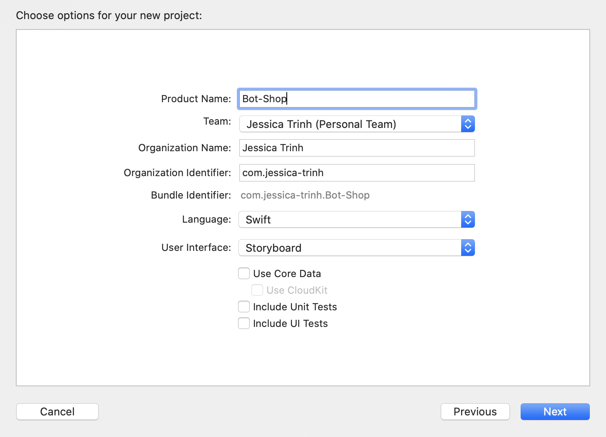
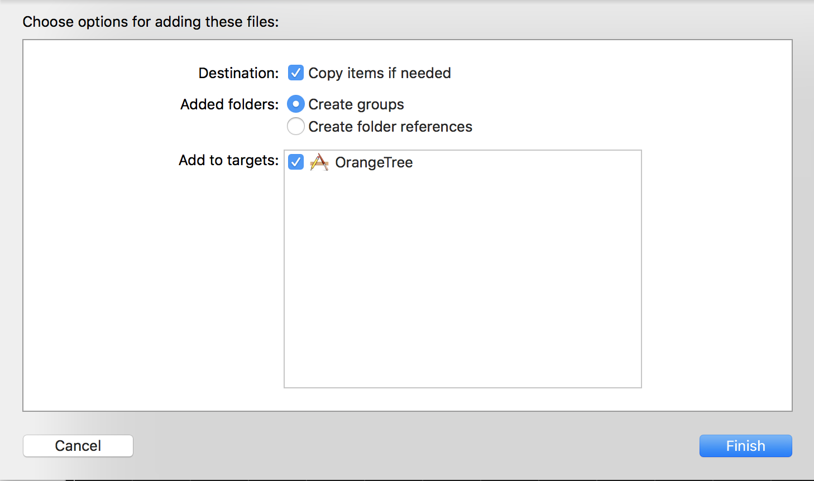

In this section, we'll get introduced to our new Xcode project and start working on implementing our Bot Shop design. It may look pretty bare bones at first but we'll be following standards of agile development to get the job done!

**Agile development** is an approach to software development that continuously delivers working software. We'll dive deeper into this concept as we move forward with our project.

# Project Setup 
In this section you are going to do some project setup in preparation for the rest of the tutorial.

# Create a New Xcode Project 

Create a new Single View App. Check that the <em>Language</em> is set to ```Swift``` and the User Interface is set to ```Storyboard``` (you read that correctly, don't worry, you'll see how to remove it soon enough).

For now you do not need to check any of the boxes like Core Data or UITests for this tutorial.
<!-- 
 -->


We'll name the app ```Bot Shop``` but feel free to name it as you please.



# Import Resources for Project 

Download the Bot Shop assets that have been created for you. Once the download has finished, unpack the zip file and drag it into the project tree on the lefthand side or <em>Project Navigator</em>. Make sure that you have `Copy items if needed` and `Create Groups` selected.



# Remove Storyboard 
Find the Main.storyboard file on your Project Navigator. Right click on the file and delete it. Make sure to click ```Move to Trash```. 

Now open the SceneDelegate.swift file on your Project Navigator.

At the top of the class add ```var window: UIWindow?```

Then locate: 
```
func scene(_ scene: UIScene, willConnectTo session: UISceneSession, options connectionOptions: UIScene.ConnectionOptions)
```

Update the body of the function with: 

```
guard let windowScene = (scene as? UIWindowScene) else { return }

window = UIWindow(frame: UIScreen.main.bounds)

// Create an instance of the main view controller and a navigation controller
let mainController = ViewController()
let navigationController = UINavigationController(rootViewController: mainController)

// Tell the window to load the main controller as it's root view
window?.rootViewController = navigationController
window?.makeKeyAndVisible()
window?.windowScene = windowScene
```

Now go to the root page of your project, look for the **Deployment Info** section, find the **Main Interface** dropdown section.

Highlight the text in the textfield that says **Main** and delete it. You should now have an empty field for Main Interface. 

Lastly, lets go to your ```Info.plist``` file and press CTRL + F "Main" to reveal all instances. 

Now remove any instances of Main that appears by clicking on the minus ( - ) symbol.

Remember to always click ```Move to Trash``` when any instances from the project. 

# Making Sure We're On Track 
For testing purposes, let's open the ```ViewController.swift``` file and set the background color to something of your choosing.

> [solution]
> See if you can remember how to change the background color of the view off the top of your mind.
>
```
view.backgroundColor = .red
```
Run your app now and you should see a red screen. If you do not then back track and make sure you have removed all instances of Main from your project. 

If you see red, then congratulations! You're on your way to developing your first fully programmatic iOS mobile application.


# Using Git/GitHub

As you go through this tutorial, you will also be making commits after completing milestones. This is a requirement, you must make a commit whenever the tutorial prompts you. This not only further enforces best practices for software engineering, but also will help you more easily figure out where a bug originated from if you break your progress up into discrete, trackable chunks.

When prompted to commit, you'll see a sample commit message. Feel free to use your own message, so long as it clearly and concisely covers the work done.

Lastly, the commit prompts in this tutorial should be the minimum amount of times you commit. If you want to do more commits, breaking your chunks into even smaller chunks, that is totally fine!


# Set Up Git/GitHub

Set up your repo!

>[action]
> Make your first commit
>
```
$ git init
$ git add .
$ git commit -m 'project init'
```

Now Go to GitHub and create a public repository called Bot-Shop, and now associate it as a remote for your local git project and then push to it.

>[action]
> Push it!
>
```
$ git remote add origin GITHUB-REPO-URL
$ git push origin master -u
```
